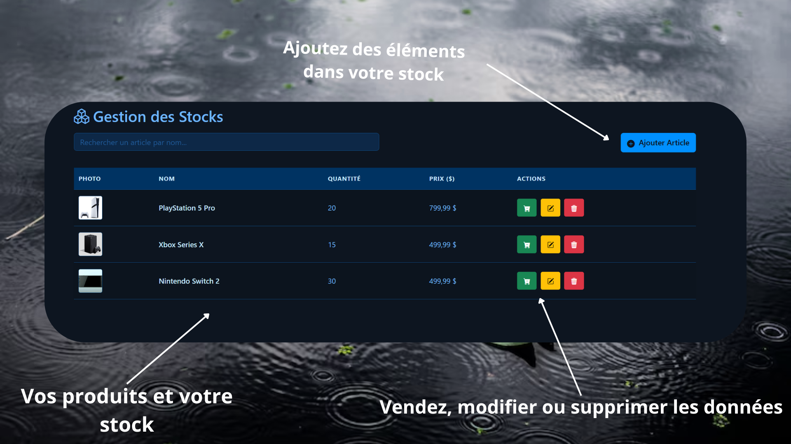

# GSK – Gestion de Stocks Web

Bienvenue sur **GSK (Gestion de Stocks Web)**, une application web moderne et intuitive pour la gestion des stocks et le suivi des ventes, développée dans le cadre de mon projet de fin de cycle en L1 LMD FASI à l'UPC.

---

## ✨ Présentation

GSK est une solution simple et efficace pour :

- **Gérer vos articles en stock** (ajout, modification, suppression, recherche rapide)
- **Suivre les ventes quotidiennes** avec un récapitulatif automatique
- **Visualiser et exporter** vos données (PDF/Excel, fonctionnalités à venir)
- **Interface responsive** et thème sombre bleuté pour un confort optimal

---

## 🖥️ Aperçu de l'application

### 1. Interface de gestion des stocks

Gérez facilement vos articles grâce à une interface claire : ajoutez, modifiez ou supprimez des produits, visualisez les quantités et prix, et effectuez des recherches instantanées.



---

### 2. Section de comptabilité des ventes

Consultez en temps réel le total des ventes de la journée, le détail de chaque transaction, et préparez l’exportation de vos données.


---

## 🚀 Fonctionnalités principales

- **Ajout, modification et suppression d’articles**
- **Recherche dynamique** par nom d’article
- **Gestion des ventes** (confirmation, suivi, calcul automatique du total)
- **Récapitulatif des ventes du jour**
- **Exportation PDF/Excel** *(bientôt disponible)*
- **Design responsive** (adapté mobile/tablette/desktop)
- **Thème sombre professionnel**

---

## 📦 Installation & Utilisation

1. **Clonez le dépôt :**
   ```bash
   git clone https://github.com/CoffeePuma55644/projet-web-gestion-de-stocks.git