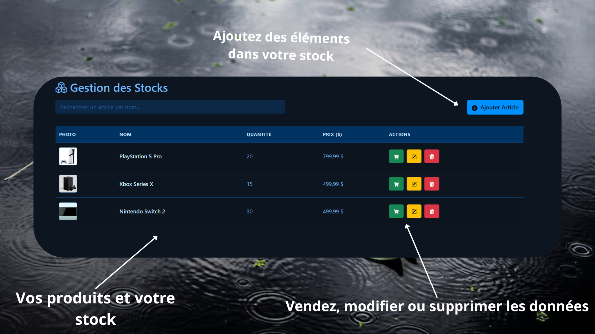
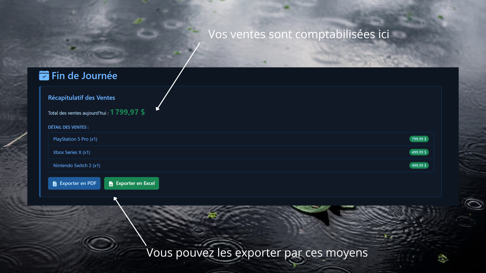

# GSK – Web Stock Management

Welcome to **GSK (Stock Management Web)**, a modern and intuitive web application for stock management and sales tracking, developed as part of my final cycle project in L1 LMD FASI at UPC.

---

## ✨ Overview

GSK is a simple and effective solution for:

- **Managing your stock items** (add, edit, delete, quick search)
- **Tracking daily sales** with automatic summary
- **Viewing and exporting** your data (PDF/Excel, upcoming features)
- **Responsive interface** with dark blue theme for optimal comfort

---

## 🖥️ Application Preview

### 1. Stock management interface

Easily manage your items with a clear interface: add, edit or delete products, view quantities and prices, and perform instant searches.



---

### 2. Sales accounting section

View real-time daily sales totals, details of each transaction, and prepare data export.



---

## 🚀 Main Features

- **Add, edit and delete items**
- **Dynamic search** by item name
- **Sales management** (confirmation, tracking, automatic total calculation)
- **Daily sales summary**
- **PDF/Excel export**
- **Responsive design** (mobile/tablet/desktop compatible)
- **Professional dark theme**

---

## 📦 Installation & Usage

1. **Clone the repository:**
   ```bash
   git clone https://github.com/CoffeePuma55644/projet-web-gestion-de-stocks.git
   ```

2. **Open the application:**
   - Open `index.html` in your web browser
   - Or use a local server for optimal performance

3. **Start using:**
   - Add your first items to the stock
   - Manage sales and track your daily revenue
   - Export your data when needed

---

## 🛠️ Technologies Used

- **HTML5** - Structure and semantics
- **CSS3** & **Bootstrap 5** - Styling and responsive design
- **JavaScript (ES6+)** - Application logic and interactivity
- **LocalStorage** - Data persistence
- **jsPDF & SheetJS** - PDF and Excel export

---

## 📱 Compatibility

- ✅ **Desktop** (Chrome, Firefox, Safari, Edge)
- ✅ **Tablet** (iPad, Android tablets)
- ✅ **Mobile** (iOS, Android)

---

## 🎯 Project Objectives

This project was developed to:
- Learn modern web technologies
- Create a practical business management solution
- Practice responsive design and user experience
- Implement data export functionality

---

## 👨‍💻 Author

**CoffeePuma** - Computer Science Student at UPC
- GitHub: [@CoffeePuma55644](https://github.com/CoffeePuma55644)
- Email: coffeepuma55644@gmail.com

---

## 📄 License

This project is developed for educational purposes as part of university studies.

---

## 🤝 Contributing

Suggestions and improvements are welcome! Feel free to open an issue or submit a pull request.

---

**GSK** - Simple and efficient stock management for everyone! 📦✨